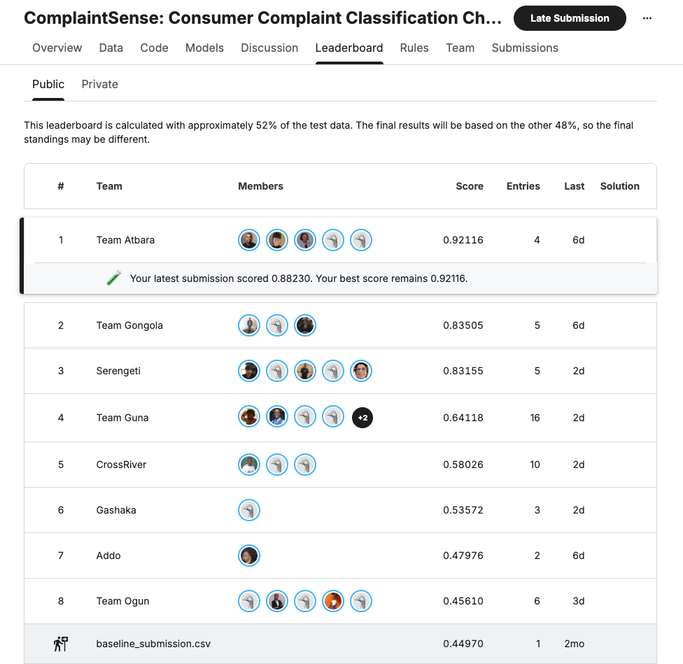
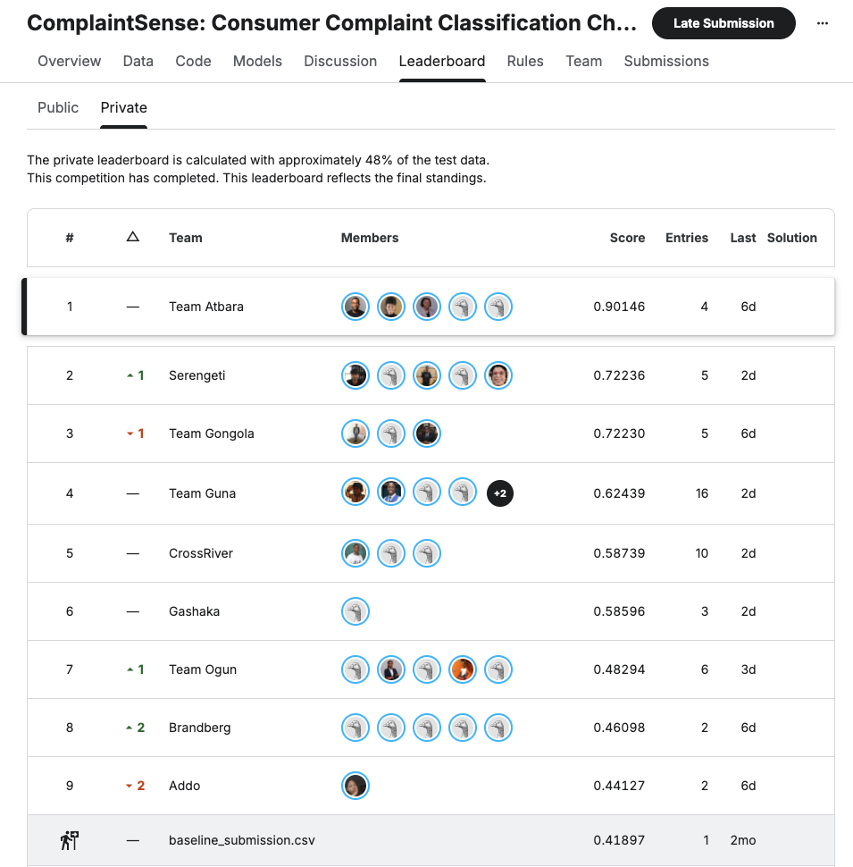

# Intelligent Complaint Classification Using Localized Transfromer Architectures

> **What we achieved: An AI-powered, enterprise-grade classification engine built on DeBERTa-v3 to automatically identify, categorize, and prioritize customer support issues across multi-channel feedback streams.**

---

## Overview

Customer feedback arrives constantly across email, social media, web forms, and chat applications. When support teams manually organize these complaints, response times slow down, urgent issues get lost, and operational costs spike.

**This project delivers** an end-to-end NLP framework designed to classify user complaints into 10 distinct operational categories. Developed for the [TRI AI Community Prediction Competition](https://aisaturdayslagos.github.io/cohort_structure/cohort10/projects.html), our solution combines **domain-adapted neural representations**, **transductive family-level probability aggregation**, and **semantic guardrail routing** to achieve **1st Place** on the leaderboard with a Public Macro F1 score of **0.92116**.


---

## Methodology & Architecture

Our winning pipeline addresses two main challenges: a small, paraphrased dataset (380 labeled complaints across 76 intent families) and fine-grained semantic category overlaps (e.g., distinguishing account access failures from active fraud).

```
┌───────────────────────────────┐
│   1. Domain Pretraining       │  13.5k Scraped App Reviews (DeBERTa-v3-base)
└───────────────┬───────────────┘
                │
┌───────────────▼───────────────┐
│   2. Target Fine-Tuning       │  5-Fold Family-Safe Ensemble (15 Models)
└───────────────┬───────────────┘
                │
┌───────────────▼───────────────┐
│   3. Structural Inference     │  Reconstruct Test Families + Probability Aggregation
└───────────────┬───────────────┘
                │
┌───────────────▼───────────────┐
│   4. Priority Guardrails      │  Deterministic Intent Disambiguation Rules
└───────────────────────────────┘

```

### 1. Two-Stage Neural Modeling

* **Domain Transfer Pretraining:** To combat the sparse official dataset, we pretrained DeBERTa-v3-base on 13,552 scraped mobile reviews (Jumia, Glovo, Bolt Food), teaching the model broad complaint phrasing before exposure to official competition rows.
* **Family-Safe Cross-Validation:** We fine-tuned the model using 5-fold `StratifiedGroupKFold` grouped by `FamilyId` across 3 random seeds. Keeping entire paraphrase families together on one side of the split prevented data leakage and ensured honest out-of-fold (OOF) evaluation.
* **Dual-View Regularization:** Models were trained simultaneously on raw complaints and canonicalized text (stripped of presentation wrappers like *"Hi support..."*), regularized using symmetric KL-divergence to enforce phrasing invariance.

### 2. Synthetic Augmentation & Diagnostic Insights

We generated 1,520 synthetic variations across four distinct writing styles (*short direct, narrative emotional, informal slang, formal technical*). Controlled benchmarking revealed that while additional text variations did not improve generalization over our clean baseline (0.7105 vs 0.7019 F1), the error analysis illuminated the model's true bottleneck: **confusion across specific intent boundaries** rather than vocabulary limitations[cite: 1].

### 3. Structured Test-Family Aggregation

The hidden test set consists of 160 complaints originating from 32 distinct intent families (5 paraphrases per scenario). Rather than classifying rows independently:

1. We reconstructed all 32 test families using string distance matching on canonical text.
2. We averaged the predicted class probability vectors across all 5 variations within a family.
3. Forcing variants to vote as a single unit eliminated single-row noise and phrasing bias.

### 4. Priority Semantic Guardrails

To eliminate recurring neural confusion pairs, we designed a deterministic, priority-ordered post-processing router (`apply_semantic_guardrails`):

* **General Inquiry:** Directs neutral questions (`?`, inquiry keywords) away from issue categories.
* **Account Access vs. Fraud:** Disambiguates lockout/2FA issues (`account_access`) from completed unauthorized actions (`fraud_unauthorized`).
* **Service, Repair & Returns:** Enforces exact intent gates for warranty claims, refund requests, and subscription changes.

---

## Leaderboard & Benchmark Progression

| Pipeline Version | Key Innovations | OOF / Dev Macro F1 | Public LB Score |
| --- | --- | --- | --- |
| **Baseline** | Character TF-IDF + Logistic Regression | 0.4497 | — |
| **Stage 1 Neural** | Single DeBERTa + Scraped Pretraining | 0.5866 | — |
| **Stage 2 Neural** | 15-Model Ensemble + Dual-View KL Loss | 0.7105 | 0.69201 |
| **Final Solution** | **DeBERTa Ensemble + Test Aggregation + Guardrails** | **0.8862** | **0.92116** |

---

## Supported Categories

The model automatically classifies incoming text into one of 10 standardized categories:

| Category | Description / Typical Trigger Phrases |
| :--- | :--- |
| **`account_access`** | Password resets, locked accounts, 2FA errors, login failures. |
| **`billing`** | Overcharges, incorrect invoices, payment gateway errors. |
| **`customer_service`** | Representative behavior, long wait times, unresolved tickets. |
| **`delivery_shipping`** | Delayed packages, lost shipments, tracking updates. |
| **`fraud_unauthorized`** | Suspicious transactions, identity theft, unauthorized card charges. |
| **`general_inquiry`** | Account features, store hours, general service questions. |
| **`product_defect`** | Damaged goods, broken items, quality assurance complaints. |
| **`refund_return`** | Return labels, refund processing status, exchange requests. |
| **`subscription_cancel`** | Membership terminations, recurring billing opt-outs. |
| **`warranty_repair`** | Product servicing, extended warranty claims, replacement parts. |

---

## Repository Structure

```text
├── data/                       
│   ├── scraped_train_data       # external scraped dataset. 14.2k rows
│   ├── comp_data                # folder contains the provided competition dataset
├── scripts/
│   └── phase8_semantic.ipynb    # Family reconstruction & final guardrails
├── docs/
│   ├── problem_statement        # why the project matters
│   ├── data_card                # Info regarding dataset and source
│   ├── impact_statement_card    # Benefits and potential harms of project
│   ├── stakeholder_engagement   # community collaboration strategies
└── README.md

```

---

## Quickstart & Execution

### Prerequisites

* NVIDIA GPU (16GB+ VRAM recommended)
* Python 3.10+
* PyTorch & Hugging Face Transformers

### Reproducing the Winning Submission

1. **Clone the repository:**
```bash
git clone https://github.com/AISaturdaysLagos/C10-team-Atbara
cd C10-team-atbara

```


2. **download the pretrained deberta model from huggingface:**
```bash
https://huggingface.co/microsoft/deberta-v3-base

Download these:

1. .gitattributes (1.18 KB (optional))
2. README.md (3.47 KB) - same details in the Model card page.
3. config.json (about 579 bytes) - Describes the model architecture
4. pytorch_model.bin (371 MB) - The actual learned model weights.
5. spm.model (2.46 MB) - The SentencePiece tokenizer, which turns text into numbers the model understands.
6. tokenizer_config.json (52 bytes) - Settings for the tokenizer.

Roughly 375 MB
```


3. **Run the Phase 8 Inference Pipeline:**
Execute `scripts/phase8_semantic.ipynb` sequentially. The script will train the neural ensemble offline, reconstruct test families, apply semantic guardrails, and output `submission.csv`.

---
## Acknowledgments & Team

* **Model Architecture:** HuggingFace Transformers & Microsoft DeBERTa-v3
* **Training Infrastructure:** PyTorch & Scikit-Learn
* [**TRI AI:**](https://tri-ai.org/) Program Organizer
* **Special thanks** to the team for the iterative experiments and optimization breakthroughs that pushed our validation metric to **0.92**!

#### Team Atbara Members
<details>
  <summary>
    <span style="color: #2563eb; font-weight: bold; font-size: 1.05em;">Justina Odoeze</span>
    <code style="color: #0c0d0e; background-color: #729ace; padding: 2px 6px; border-radius: 4px; font-size: 0.95em;">Team Leader</code>
  </summary>

- [LinkedIn](https://www.linkedin.com/in/elochukwuodoeze)
- [GitHub](https://github.com/Elocodes)
</details>

<details>
  <summary>
    <span style="color: #2563eb; font-weight: bold; font-size: 1.05em;">Nzube Ohalete</span>
    <code style="color: #0c0d0e; background-color: #729ace; padding: 2px 6px; border-radius: 4px; font-size: 0.95em;">Team Leader 2</code>
    </summary>

- [LinkedIn](https://www.linkedin.com/in/nzube-ohalete)
- [GitHub](https://github.com/Profzubbyd)
</details>


<details>
  <summary>
    <span style="color: #2563eb; font-weight: bold; font-size: 1.05em;">Sheree Edmund</span>
    </summary>

- [LinkedIn](https://www.linkedin.com/in/sheree-edmund)
- [GitHub](https://github.com/Sheree1986)
</details>

<details>
  <summary>
    <span style="color: #2563eb; font-weight: bold; font-size: 1.05em;">Faith Kasunga</span>
    </summary>

- [LinkedIn](https://www.linkedin.com/in/sheree-edmund)
- [GitHub](https://github.com/Sheree1986)
</details>

<details>
  <summary>
    <span style="color: #2563eb; font-weight: bold; font-size: 1.05em;">Sheila Nalweyiso </span>
    </summary>

- [LinkedIn](https://www.linkedin.com/in/sheree-edmund)
- [GitHub](https://github.com/Sheree1986)
</details>

---

### Team Atbara's results on Kaggle
#### Public Leaderboard


#### Final Leaderboard
